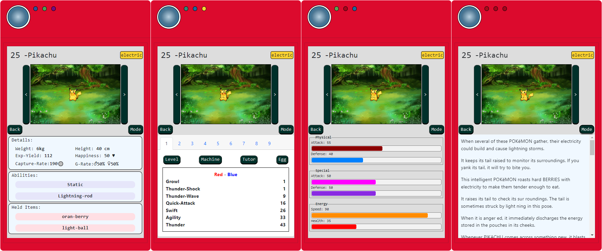
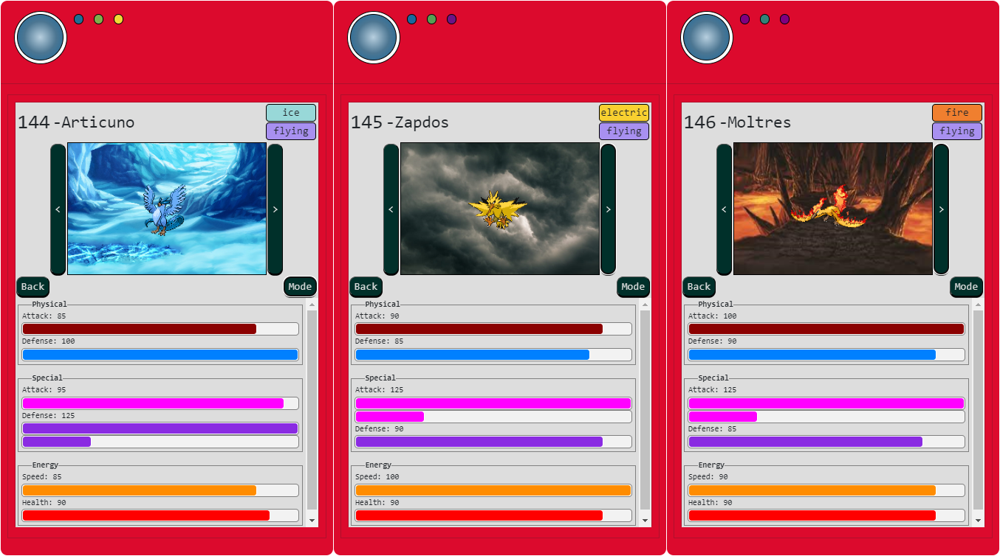

# Pokedex

## Sobre o Projeto:

> Este projeto recria uma Pokédex que consome os dados da Pokeapi. A ideia é ter um Pokédex super completa criada em Angular que pode ser visualisada na tela do celular de uma forma e diferente na tela do computador. Estou criando aos poucos no meu tempo livre.

## Deploy do projeto:

<https://andy-pokedex.netlify.app/>

## Tecnologias_usadas_no_desenvolvimento

- **TypeScript** Linguagem de programação usada na criação do projeto
- **Angular** Framework utilizado no desenvolvimento
- **Bootstrap** Biblioteca de estilização dos componentes

## Recursos

> O carregamento da lista é dinâmico, trazendo os próximos pokemons de acordo com a rolagem da pokédex. Você também pode escolher trazer apenas pokemons de uma determinada geração, mas por padrão ela trará todos em ordem pela opção "Get'em all".

> Ao clicar em algum pokemon da lista, os detalhes serão mostrados. Tendo opção de exibir "informações","Atributos","Detalhes" e "Golpes", usando o botão: mode para mudar a exibição. O botão "back" retorna a lista.

> A pokédex reconhece o habitat de cada Pokemon e a exibe como fundo de tela.

> Os atributos mostram os ataques e defesa físico e especiais, além da enérgia e velocidade de cada pokémon.

> A lista de Golpes é vista pela Geração nas abas, clique para ver cada aba.

## Etapas Iniciais

- [x] Deploy do projeto no Netlify
- [x] Instalação do Bootstrap
- [x] Conexão com a API: pokeapi
- [x] Layout da tela do projeto
- [x] Listagem dos Pokemons
- [x] Layout da tela de listagem
- [x] Exibição de Informações do Pokemon escolhido
- [x] Layout da tela do Pokemon escolhido

## Próximas etapas

- [x] Trazer habilidades em um dos modos
- [x] Trazer outras informações em um dos modos
- [x] Trazer Golpes em um dos modos
- [x] Trazer grupo de Ovos em um dos modos
- [ ] Opção de grupo de Ovos na listagem
- [ ] Opção de buscar por nome do pokemon na listagem
